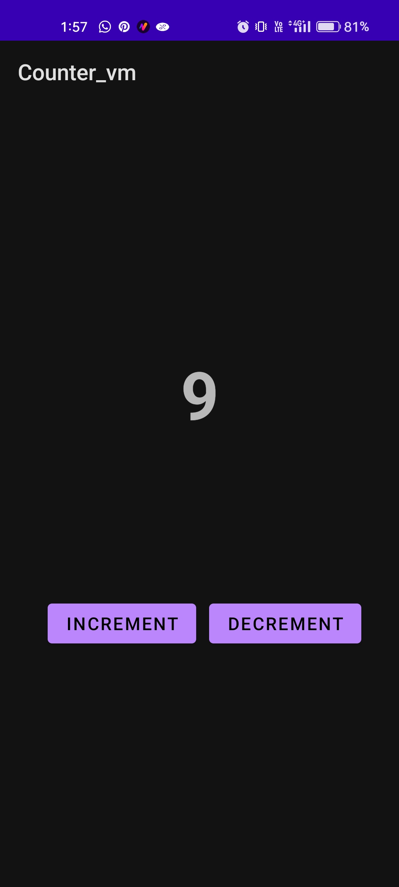
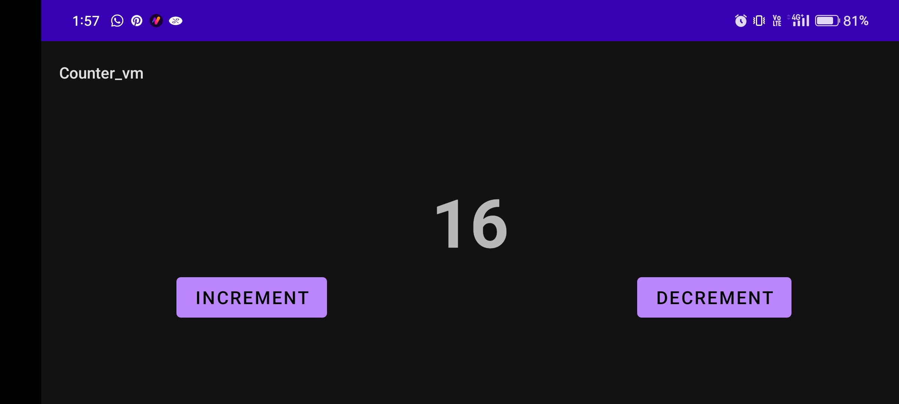

# ViewModelCounterApp

A basic counter app showcasing Android's ViewModel architecture using Kotlin.

## Features

- Tap to increment or decrement the counter.
- ViewModel preserves the counter state during configuration changes.

## Getting Started

1. Clone the repository: 
```
 git clone https://github.com/Paulraj916/ViewModelCounterApp.git 
```
2. Open the project in Android Studio.
3. Build and run the app.

## Screenshots

<div align="left">
    
    
</div>


## Contributing

Contributions are welcome! Open a pull request following the project's coding standards.

## License

This project is licensed under the MIT License.
